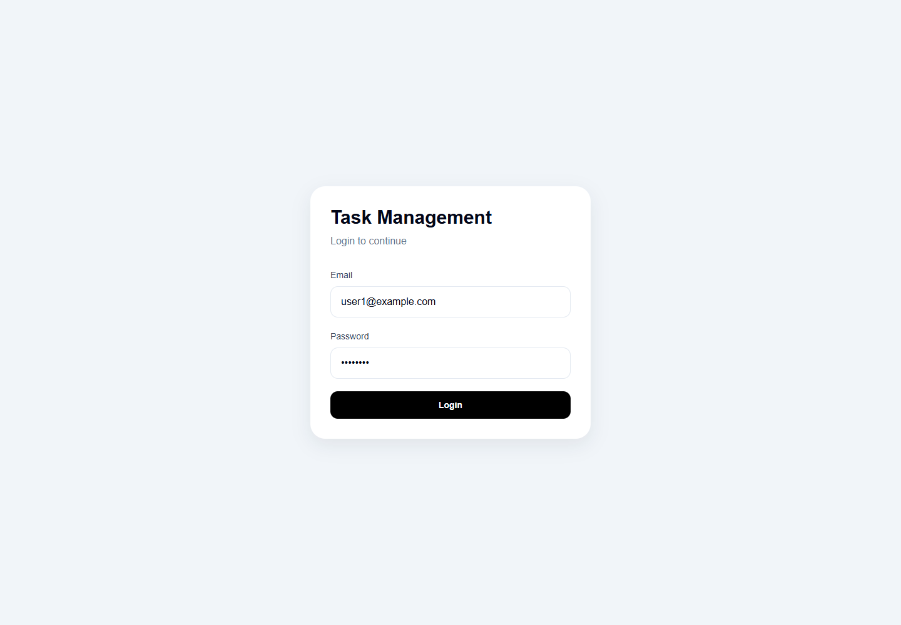
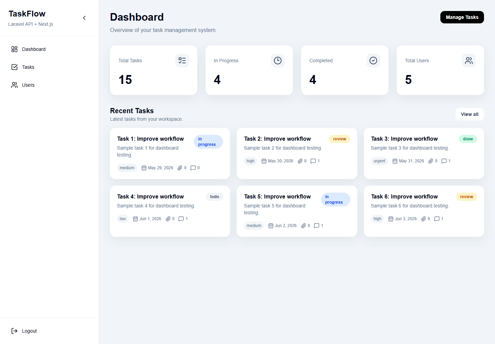
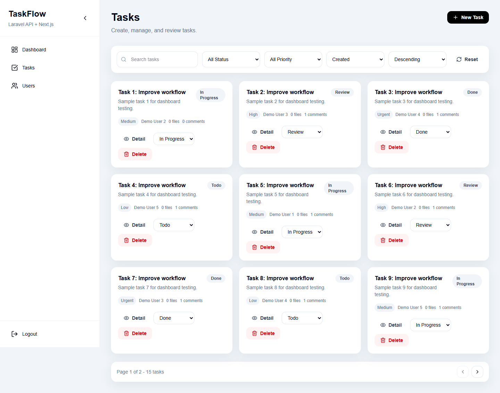
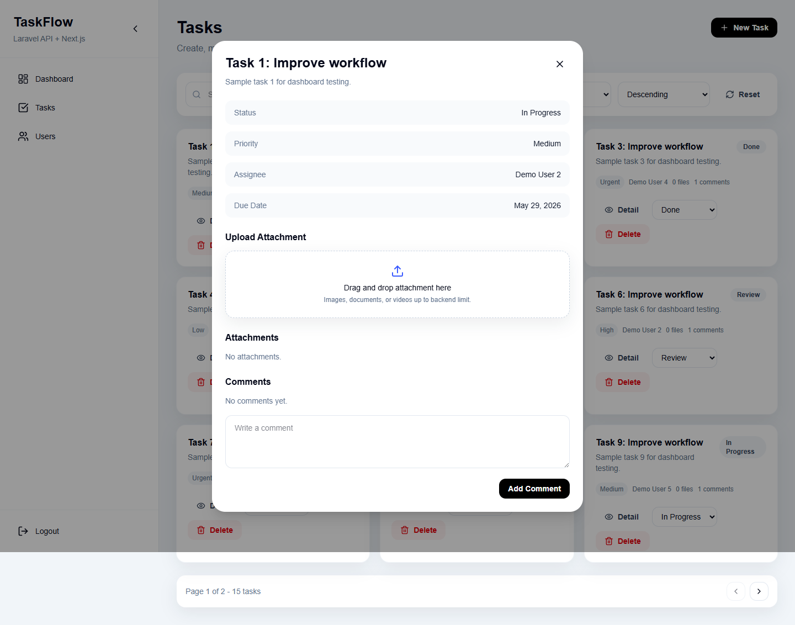
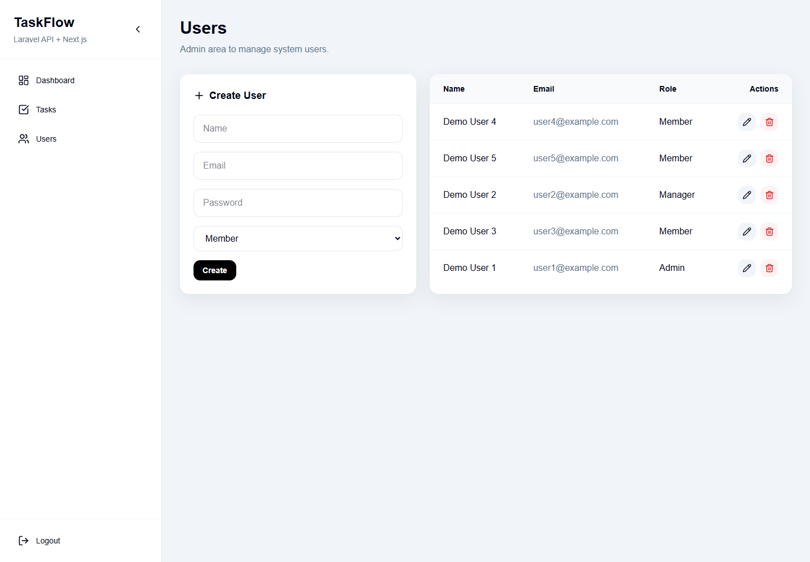

# TaskFlow - Full-Stack Task Management Platform

TaskFlow is a Laravel + Next.js task management platform built for the full-stack technical assessment. It includes JWT authentication, role-based task access, task CRUD, attachments, comments, Server-Sent Events realtime refresh, database queues, and documentation artifacts.

## Stack

- Backend: Laravel 13, PHP 8.3, JWT Auth, Eloquent, database queue
- Frontend: Next.js 16, React 19, TypeScript, Tailwind CSS
- Database: MySQL-ready migrations, SQLite-friendly local/test setup
- API docs: `documentation/api-docs/openapi.yaml`
- SQL schema: `backend/database/schema.sql`

## Features

- Authentication: login, logout, current user endpoint with JWT.
- Task management: paginated list, search, filters, sorting, create, update, delete.
- Role access:
  - Admin: all task actions and user management.
  - Manager: create, update, delete tasks, assign users, upload files, comment.
  - Member: sees assigned tasks only, can update status, upload files, download files, and comment.
- Attachments: secure private storage, MIME/size validation, versioning, scan status simulation, image thumbnail placeholder job.
- Comments: authenticated task comments with realtime refresh support.
- Background jobs: assignment notification simulation, attachment processing, bulk status update, CSV task export.
- Realtime: Server-Sent Events endpoint consumed by the dashboard and task page.
- Frontend: clean responsive dashboard, drag-and-drop upload, progress indicator, SweetAlert feedback.

## Demo Accounts

After running the seeder:

| Role | Email | Password |
| --- | --- | --- |
| Admin | `user1@example.com` | `password` |
| Manager | `user2@example.com` | `password` |
| Member | `user3@example.com` | `password` |
| Member | `user4@example.com` | `password` |
| Member | `user5@example.com` | `password` |

## Backend Setup

```bash
cd backend
composer install
cp .env.example .env
php artisan key:generate
php artisan jwt:secret
```

Configure MySQL in `backend/.env`:

```env
DB_CONNECTION=mysql
DB_HOST=127.0.0.1
DB_PORT=3306
DB_DATABASE=taskflow
DB_USERNAME=root
DB_PASSWORD=
QUEUE_CONNECTION=database
```

Run database setup:

```bash
php artisan migrate --seed
php artisan storage:link
php artisan serve
```

Run the queue worker in a second terminal:

```bash
php artisan queue:work
```

Backend API defaults to `http://localhost:8000/api`.

## Frontend Setup

```bash
cd frontend
npm install
```

Create `frontend/.env.local`:

```env
NEXT_PUBLIC_API_URL=http://localhost:8000/api
```

Run the frontend:

```bash
npm run dev
```

Frontend defaults to `http://localhost:3000`.

## API Documentation

- OpenAPI: <a href="./documentation/api-docs/openapi.yaml">openapi.yaml</a>
- Postman collection: <a href="./documentation/api-docs/postman-collection.json">postman-collection.json</a>
- Architecture notes: <a href="./documentation/architecture.md">architecture.md</a>
- SQL schema: <a href="./backend/database/schema.sql">schema.sql</a>

Important endpoints:

- `POST /api/auth/login`
- `GET /api/tasks`
- `POST /api/tasks`
- `PUT /api/tasks/{id}`
- `DELETE /api/tasks/{id}`
- `POST /api/tasks/{id}/attachments`
- `POST /api/tasks/{id}/comments`
- `GET /api/realtime/tasks?token={jwt}`
- `POST /api/tasks/bulk-status`
- `POST /api/tasks/export`

## Verification

Backend:

```bash
cd backend
php artisan test
```

Frontend:

```bash
cd frontend
npm run lint
npx tsc --noEmit
npm run build
```

## Screenshots

<h3>Login</h3>  
<h3>Dashboard</h3>  
<h3>Task</h3>  
<h3>Task Detail</h3>  
<h3>Users</h3>  

## Video Preview
<a href="https://drive.google.com/file/d/1jhP2utsXaDET3gaWiYcekUUY2Hk5wyM-/view?usp=drive_link">Link Preview Video</a>
